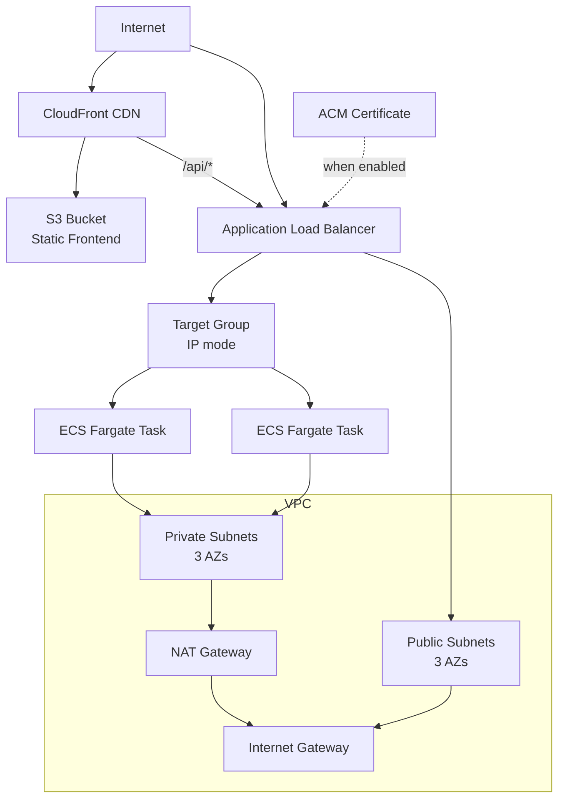

# AWS Infrastructure (Terraform + Terragrunt)

AWS infrastructure managed with [OpenTofu](https://opentofu.org/) modules and [Terragrunt](https://terragrunt.gruntwork.io/) live configurations.

## Architecture

